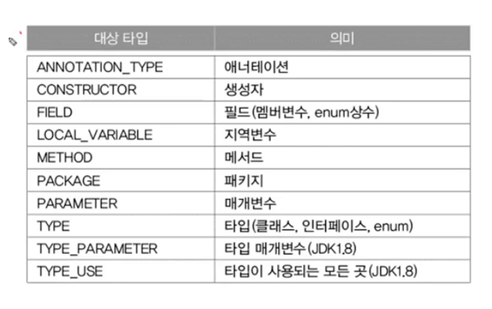

# 애너테이션

## 애너테이션

- 주석처럼 프로그래밍 언어에 영향을 미치지 않으며, 유용한 정보를 제공
    - 과거에는 소스 코드와 문서를 따로 관리 했다…소스코드가 변경 돼도 문서는 안하면서 불일치가 생김
        - 문서와 코드를 하나로 합쳐서 이 문제를 해결 (javadoc)
    - 애너테이션도 위와 같은 문제로 생김
    - 소스코드(java)와 설정 파일(xml)이 따로 분리되어 있다보니 불일치가 생김
        - 설정과 소스코드를 합침 → 애너테이션

## 표준 애너테이션

- Java에서 제공하는 애너테이션

  

    - 아래 색이 다른 애들
        - 메타 애너테이션 : 애너테이션을 만들어서 사용

- @Override
    - 오버라이딩을 올바르게 했는지 컴파일러가 체크하게 한다
    - 오버라이딩 할 때 메서드 이름을 잘못적는 실수를 하는 경우가 많다
        - 이를 예방하기 위해 나옴
    - 오버라이딩 할 때는 선언부 앞에 @Override 붙이자

- @Deprecated
    - 앞으로 사용하지 않을 것을 권장하는 필드나 메서드에 붙인다

- @FunctionalInteface
    - 함수형 인터페이스에 붙이면, 컴파일러가 올바르게 작성했는지 체크
    - 함수형 인터페이스에는 **하나의 추상 메서드**만 가져야 한다는 제약이 있다

        ```java
        @FunctionalInterface 
        interface Testable {
        	void test();
        	void check();
        }
        
        // error -> 함수형 인터페이스는 하나의 추상 메서드만 가능
        ```

- @SuppressWarnings
    - 컴파일러의 경고 메시지가 나타나지 않게 억제한다
        - 이 경고는 확인했다고 알려주는 용도로 사용 가능
    - 괄호()안에 억제하고자 하는 경고의 종류를 문자열로 지정

        ```java
        @SuppressWarning("unchecked") // 지네릭스와 관련된 경고를 억제
        ArrayList list = new ArrayList(); // 지네릭 타입을 지정하지 않았음
        list.add(obj); // 여기서 경고 발생
        ```

    - 둘 이상의 경고를 동시에 억제하려면 다음과 같이 한다

        ```java
        @SuppressWarning({"deprecation", "unchecked"})
        ```

    - ‘-Xlint’ 옵션을 통해 컴파일 시 경고 메세지 확인 가능

## 메타 애너타이션

- 메타 애너테이션은 ‘애너테이션을 위한 애너테이션’
- 메타 애너테이션은 java.lang.annotation에 있다

- @Target
    - 애너테이션을 정의할 때, 적용 대상 지정에 사용

        ```java
        @Target({TYPE, FIELD, METHOD, PARAMETER})
        @Retention(RetentionPollicy.SOURCE)
        public @interface SuppressWarnings {
        	String[] value();
        }
        ```

      

- @Retention
    - 애너테이션이 유지되는 기간을 지정하는데 사용

  

    - 컴파일러에 의해 사용되는 애너테이션의 유지 정책은 SOURCE이다.
    - 실행 시에 사용 가능한 애너테이션의 정책은 RUNTIME이다.

- @Documented
    - javadoc으로 작성한 문서에 포함시키려면 @Documented를 붙인다

- @Inherited
    - 애너테이션을 자손 클래스에 상속하고자 할 때, @Inherited를 붙인다
    - 애너테이션도 상속 된다

        ```java
        @Inherited
        @interface SuperAnno {} // @SuperAnno가 자손까지 영향 미치게
        
        @SuperAnno
        class Parent {}
        
        class Child extends Parent {} // Child에 애너테이션이 붙은 것으로 인식
        ```


- @Repetable
    - 반복해서 붙일 수 있는 애너테이션을 정의할 때 사용

        ```java
        @Repeatable(ToDos.class)
        @interface ToDO {
        	String value();
        }
        ```

    - @Repeatable이 붙은 애너테이션은 반복해서 붙일 수 있다

        ```java
        @ToDo("delete test codes")
        @ToDo("override inherited methods")
        class MyClass {
        	// ...
        }
        ```

    - @Repeatable인 @ToDo를 하나로 묶을 컨테이너 애너테이션도 정의해야 함
    ```java
    @interface ToDos { // 여러 개의 ToDo 애너테이션을 담을 컨테이너 애너테이션 ToDos
	    ToDo[] value();
    }
    ```